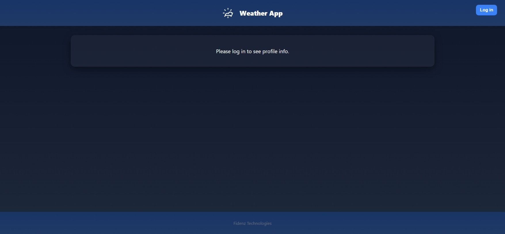
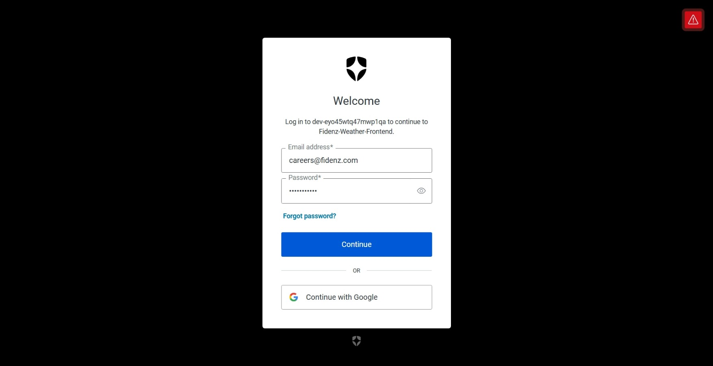
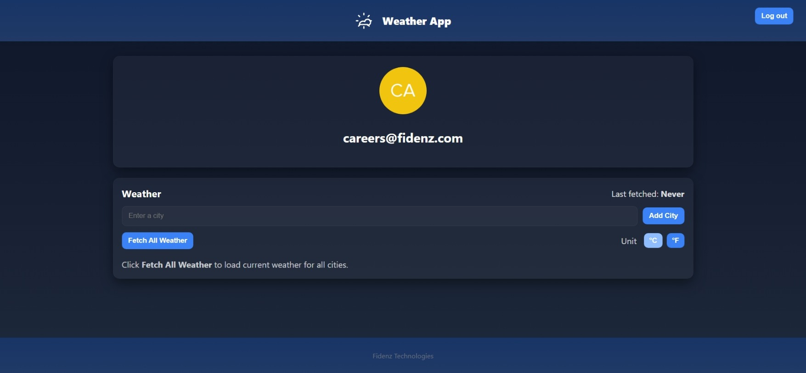
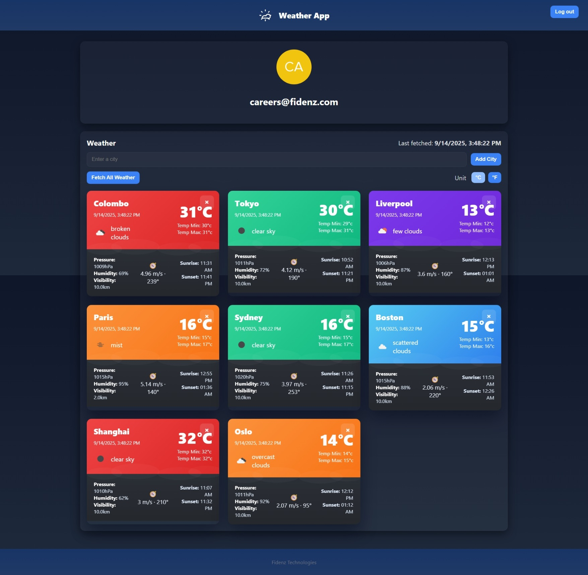
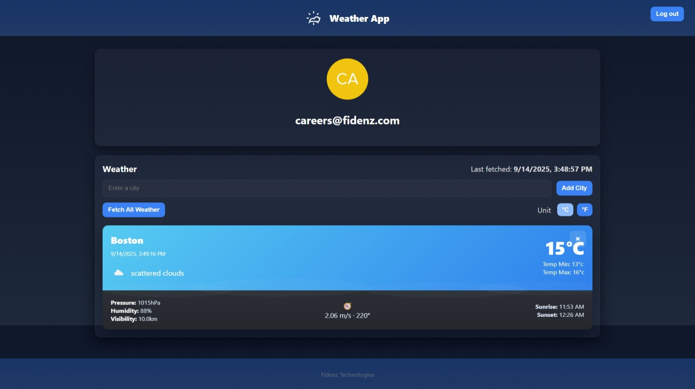
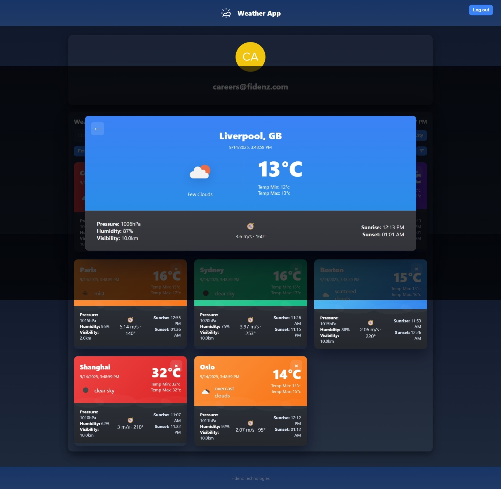

# Weather Information Web API Application

A full-stack web application for searching, adding, and viewing weather information for cities around the world.  
This project includes both a **frontend** (React) and a **backend** (Node.js/Express).

---

## Table of Contents

- [Features](#features)
- [Project Structure](#project-structure)
  - [Frontend](#frontend-structure)
  - [Backend](#backend-structure)
- [Screenshots](#screenshots)
- [Getting Started](#getting-started)
  - [Backend Setup](#backend-setup)
  - [Frontend Setup](#frontend-setup)
- [Tech Stack](#tech-stack)
- [License](#license)

---

## Features

- User authentication (Auth0)
- Search and add cities to your weather dashboard
- View current weather details for multiple cities
- Responsive, modern UI with weather cards and details
- Secure backend API for weather data

---

## Project Structure

### Frontend Structure

```
frontend/
│   .env.local
│   .gitignore
│   index.html
│   package.json
│   README.md
│   vite.config.js
│
├── public/
│     vite.svg
│
└── src/
      app.jsx
      main.jsx
      style.css
      assets/
        icons/
      components/
        CityCard.jsx
        CityDetail.jsx
        Profile.jsx
        Weather.jsx
        WeatherList.jsx
      pages/
```

### Backend Structure

```
backend/
│   .env
│   .gitignore
│   cities.json
│   package.json
│   server.js
│
└── src/
      app.js
      routes/
        health.js
        weather.js
      utils/
        fetchWeather.js
```

---

## Screenshots

> Screenshots are located in the `resources/` folder.

### Home Page



### Login Page



### Weather Cards



### City Details



### Add City & Empty State




---

## Getting Started

### Backend Setup

1. **Install dependencies:**
   ```bash
   cd backend
   npm install
   ```
2. **Configure environment variables:**  
   Copy `.env.example` to `.env` and fill in required values (API keys, Auth0, etc).

3. **Start the backend server:**
   ```bash
   node server.js
   ```
   The backend will run on the port specified in `.env`.

### Frontend Setup

1. **Install dependencies:**
   ```bash
   cd frontend
   npm install
   ```
2. **Configure environment variables:**  
   Copy `.env.local.example` to `.env.local` and fill in required values (API endpoints, Auth0, etc).

3. **Start the frontend dev server:**
   ```bash
   npm run dev
   ```
   The frontend will run on [http://localhost:5173](http://localhost:5173) (default Vite port).

---

## Tech Stack

- **Frontend:** React, Vite, CSS
- **Backend:** Node.js, Express
- **Authentication:** Auth0
- **Weather Data:** OpenWeatherMap API (or similar)
- **Other:** Axios, dotenv

---

## License

This project is licensed under the MIT License.

---
