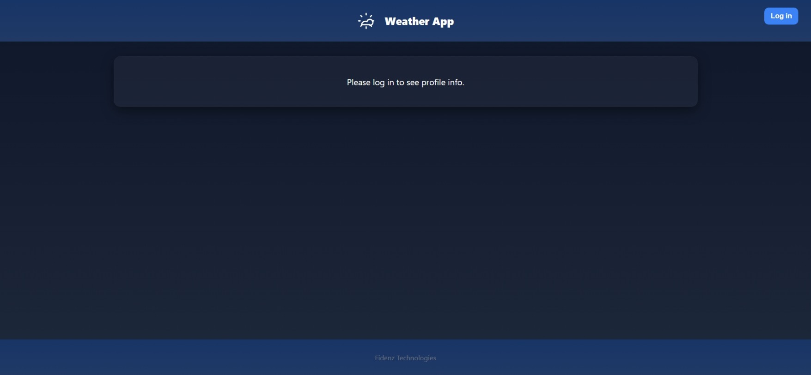
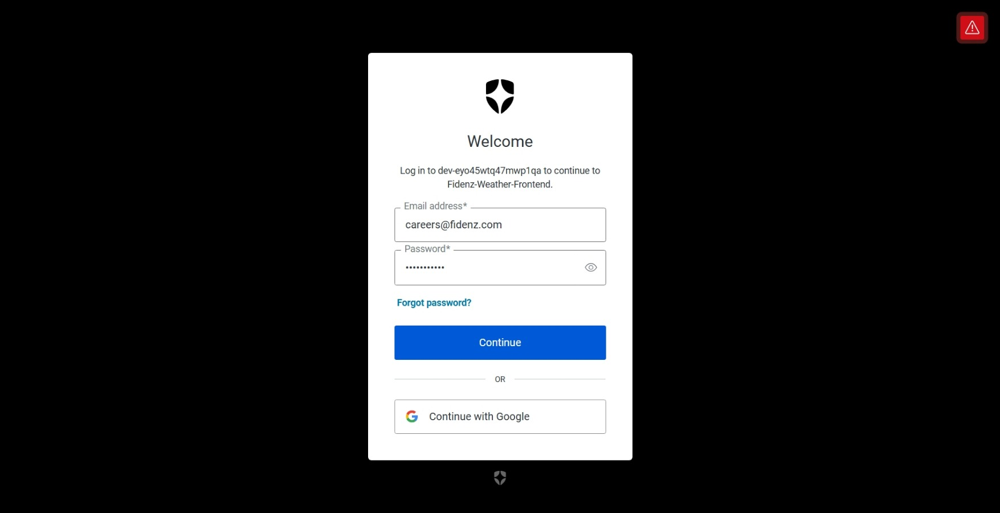
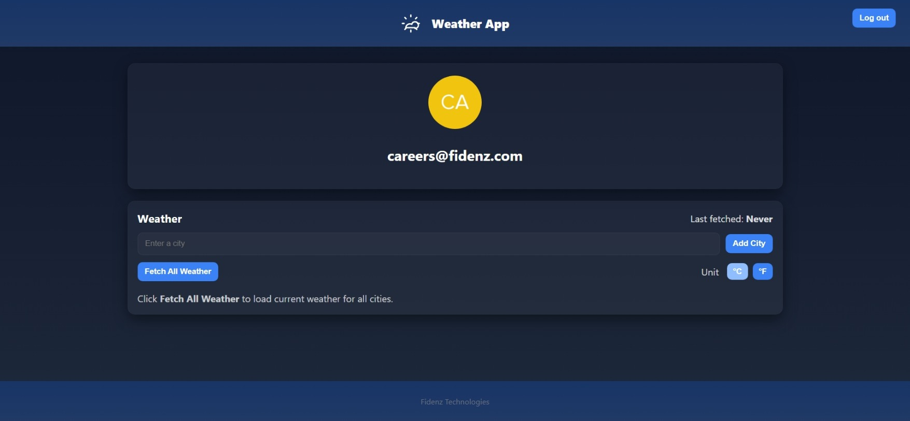
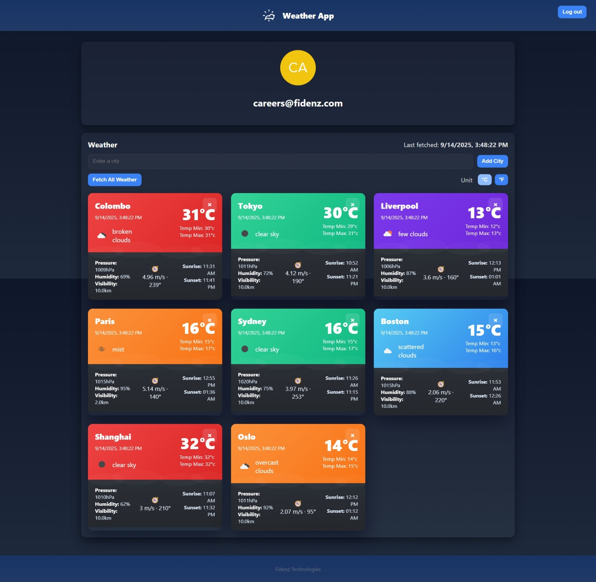
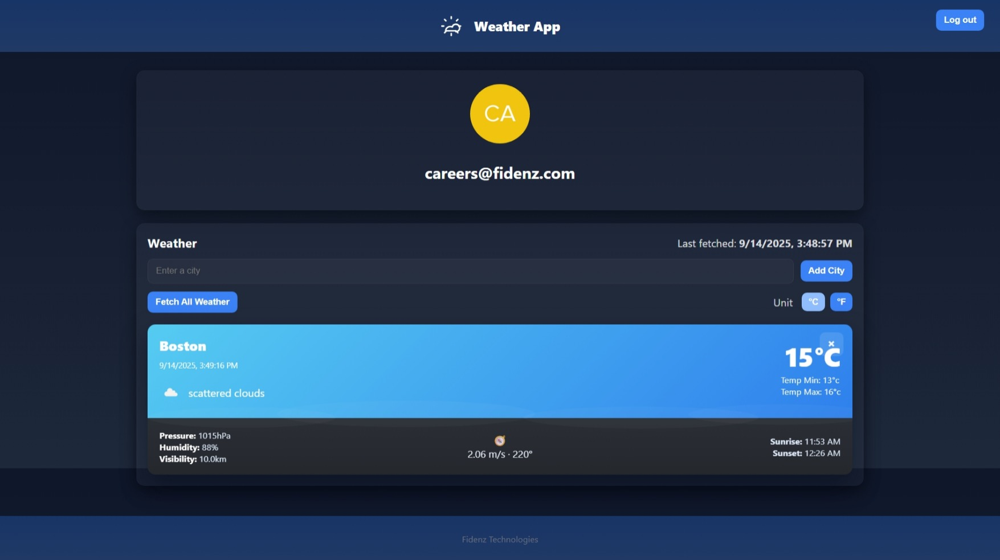
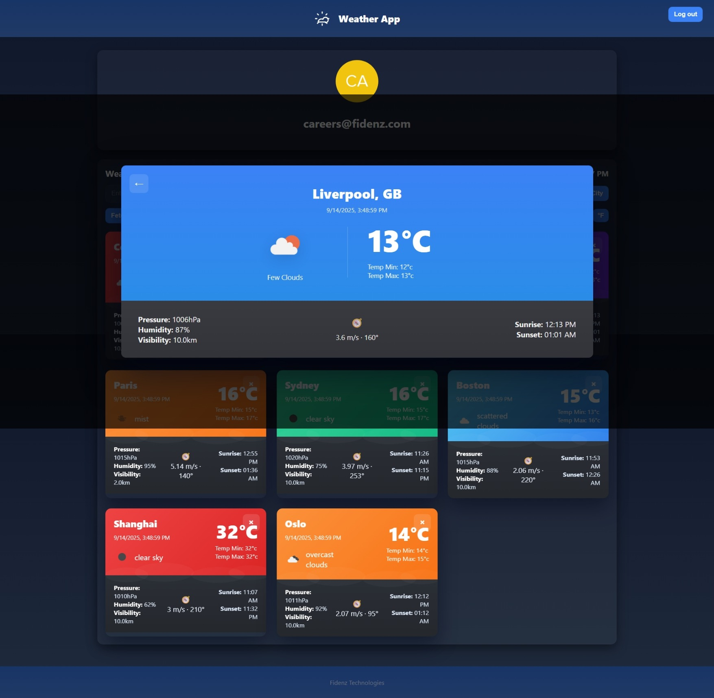

# Weather Information Web API Application - Frontend

## Overview
This is the frontend for the Weather Information Web API Application. It provides a modern, responsive UI for users to view weather data for multiple cities, add new cities, and see detailed weather information. Authentication is handled via Auth0.

## Features
- User authentication (login/logout)
- Profile display
- Add city by name (with suggestions)
- Fetch and display weather for all cities
- Weather cards with details (temperature, humidity, pressure, wind, sunrise/sunset, etc.)
- Detailed view for each city
- Responsive and visually appealing design

## Folder Structure
```
frontend/
  .env.local
  index.html
  package.json
  vite.config.js
  public/
    vite.svg
  src/
    app.jsx
    main.jsx
    style.css
    assets/
      icons/
    components/
      CityCard.jsx
      CityDetail.jsx
      Profile.jsx
      Weather.jsx
      WeatherList.jsx
    pages/
```

## Main Components
- **app.jsx**: Main app layout, header, authentication buttons, and routing.
- **Profile.jsx**: Shows user info after login.
- **Weather.jsx**: Main weather dashboard, add/search city, weather cards, and details.
- **WeatherList.jsx**: Renders a grid of weather cards.
- **CityCard.jsx**: Individual weather card for a city.
- **CityDetail.jsx**: Expanded weather details for a selected city.

## Usage
1. Install dependencies:
   ```bash
   npm install
   ```
2. Set up `.env.local` with your Auth0 and backend API settings.
3. Start the frontend:
   ```bash
   npm run dev
   ```
4. Log in and use the app to view, add, and manage city weather data.

## Screenshots
Below are some screenshots of the application in use:

### Home Page


### Login Page


### Weather Cards


### City Details


### Add City


### Empty State


## Technologies
- React
- Vite
- Auth0
- Axios
- CSS

## License
2021 Fidenz Technologies
